<!--
**b00y0h/b00y0h** is a ✨ _special_ ✨ repository because its `README.md` appears on your GitHub profile.
-->

<!--
<p align="center"></p>
-->
<div>
<h1 align="center">Hi 👋, I'm Bob</h1>
<h3 align="center">A passionate Fullstack Developer and Tech Enthusiast</h3>

## 📇 My NPX Business Card

Try out my interactive business card by running:

```bash
npx bobsmith
```


- 🌍 &nbsp; Based in Virginia
- 🔭 &nbsp; Currently working on open source projects and client solutions at [EAB Agency](https://github.com/orgs/eab-agency)
- 💬 &nbsp; Ask me about **React**, **Next.js**, **Node.js**, **TypeScript**, and **CI/CD**
- 📫 &nbsp; Reach me at **<bobby@reversetype.com>**


  </div>

<p align="center">
  <a href="https://www.linkedin.com/in/bobbysmith/" target="_blank">
    
  </a>
 <a href="https://x.com/ux_bob" target="_blank">
  
</a>

  <a href="https://github.com/b00y0h" target="_blank">
    
  </a>
</p>

  <!-- GitHub section -->

## My GitHub Stats 

<picture>
  <source media="(prefers-color-scheme: dark)" srcset="profile/stats-dark.svg" />
  
</picture>
<picture>
  <source media="(prefers-color-scheme: dark)" srcset="profile/top-langs-dark.svg" />
  
</picture>
<br clear="both" />

<picture>
  <source media="(prefers-color-scheme: dark)" srcset="https://streak-stats.demolab.com?user=b00y0h&theme=dark&hide_border=true&exclude_days=Sun%2CSat" />
  
</picture>

<!-- GitHub section: END -->

## Getting Things Done

### Todoist Stats

<!-- TODO-IST:START -->
🏆  **2,971** Karma Points           
🌸  Completed **0** tasks today           
✅  Completed **339** tasks so far           
🔥  Current streak: **1 day**           
⏳  Longest streak is **2** days
<!-- TODO-IST:END -->

<!--START_SECTION:waka-->


**🐱 My GitHub Data** 

> 📦 1.4 MB Used in GitHub's Storage 
 > 
> 🏆 305 Contributions in the Year 2026
 > 
> 💼 Opted to Hire
 > 
> 📜 89 Public Repositories 
 > 
> 🔑 23 Private Repositories 
 > 
**I'm an Early 🐤** 

```text
🌞 Morning                10613 commits       ██████░░░░░░░░░░░░░░░░░░░   25.26 % 
🌆 Daytime                20857 commits       ████████████░░░░░░░░░░░░░   49.63 % 
🌃 Evening                8085 commits        █████░░░░░░░░░░░░░░░░░░░░   19.24 % 
🌙 Night                  2467 commits        █░░░░░░░░░░░░░░░░░░░░░░░░   05.87 % 
```
📅 **I'm Most Productive on Thursday** 

```text
Monday                   6149 commits        ████░░░░░░░░░░░░░░░░░░░░░   14.63 % 
Tuesday                  6503 commits        ████░░░░░░░░░░░░░░░░░░░░░   15.48 % 
Wednesday                9795 commits        ██████░░░░░░░░░░░░░░░░░░░   23.31 % 
Thursday                 9961 commits        ██████░░░░░░░░░░░░░░░░░░░   23.70 % 
Friday                   7775 commits        █████░░░░░░░░░░░░░░░░░░░░   18.50 % 
Saturday                 1350 commits        █░░░░░░░░░░░░░░░░░░░░░░░░   03.21 % 
Sunday                   489 commits         ░░░░░░░░░░░░░░░░░░░░░░░░░   01.16 % 
```


📊 **This Week I Spent My Time On** 

```text
🕑︎ Time Zone: America/New_York

💬 Programming Languages: 
Markdown                 30 mins             █████████████████░░░░░░░░   68.75 % 
Other                    7 mins              ████░░░░░░░░░░░░░░░░░░░░░   16.00 % 
TOML                     6 mins              ████░░░░░░░░░░░░░░░░░░░░░   14.51 % 
YAML                     0 secs              ░░░░░░░░░░░░░░░░░░░░░░░░░   00.43 % 
JavaScript               0 secs              ░░░░░░░░░░░░░░░░░░░░░░░░░   00.26 % 

🔥 Editors: 
VS Code                  44 mins             █████████████████████████   100.00 % 

💻 Operating System: 
Mac                      44 mins             █████████████████████████   100.00 % 
```

**I Mostly Code in TypeScript** 

```text
TypeScript               46 repos            █████████░░░░░░░░░░░░░░░░   36.51 % 
Swift                    12 repos            ██░░░░░░░░░░░░░░░░░░░░░░░   09.52 % 
CSS                      7 repos             █░░░░░░░░░░░░░░░░░░░░░░░░   05.56 % 
Python                   5 repos             █░░░░░░░░░░░░░░░░░░░░░░░░   03.97 % 
Shell                    4 repos             █░░░░░░░░░░░░░░░░░░░░░░░░   03.17 % 
```


 Last Updated on February 13, 2026 00:58:59 UTC
<!--END_SECTION:waka-->

<p align="center">
  
</p>

<p align="center">
  
  
  
  
  
  
</p>
