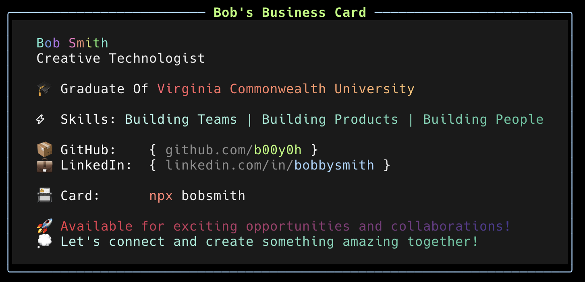

<!--
**b00y0h/b00y0h** is a ✨ _special_ ✨ repository because its `README.md` appears on your GitHub profile.
-->

<!--
<p align="center"></p>
-->
<div>
<h1 align="center">Hi 👋, I'm Bob</h1>
<h3 align="center">A passionate Fullstack Developer and Tech Enthusiast</h3>

## 📇 My NPX Business Card

Try out my interactive business card by running:

```bash
npx bobsmith
```



- 🌍 &nbsp; Based in Virginia
- 🔭 &nbsp; Currently working on open source projects and client solutions at [EAB Agency](https://github.com/orgs/eab-agency)
- 💬 &nbsp; Ask me about **React**, **Next.js**, **Node.js**, **TypeScript**, and **CI/CD**
- 📫 &nbsp; Reach me at **<bobby@reversetype.com>**


  </div>

<p align="center">
  <a href="https://www.linkedin.com/in/bobbysmith/" target="_blank">
    
  </a>
 <a href="https://x.com/ux_bob" target="_blank">
  
</a>

  <a href="https://github.com/b00y0h" target="_blank">
    
  </a>
</p>

  <!-- GitHub section -->

## My GitHub Stats 

[](https://github.com/anuraghazra/github-readme-stats)
[](https://git.io/streak-stats)


<!-- GitHub section: END -->

## Getting Things Done

### Todoist Stats

<!-- TODO-IST:START -->
🏆  2,612 Karma Points           
🌸  Completed 1 tasks today           
✅  Completed 314 tasks so far           
⏳  Longest streak is 2 days
<!-- TODO-IST:END -->

<!--START_SECTION:waka-->


**🐱 My GitHub Data** 

> 📦 1.3 MB Used in GitHub's Storage 
 > 
> 🏆 489 Contributions in the Year 2025
 > 
> 💼 Opted to Hire
 > 
> 📜 73 Public Repositories 
 > 
> 🔑 17 Private Repositories 
 > 
**I'm an Early 🐤** 

```text
🌞 Morning                3381 commits        ██████░░░░░░░░░░░░░░░░░░░   22.30 % 
🌆 Daytime                8071 commits        █████████████░░░░░░░░░░░░   53.23 % 
🌃 Evening                2933 commits        █████░░░░░░░░░░░░░░░░░░░░   19.34 % 
🌙 Night                  778 commits         █░░░░░░░░░░░░░░░░░░░░░░░░   05.13 % 
```
📅 **I'm Most Productive on Thursday** 

```text
Monday                   2371 commits        ████░░░░░░░░░░░░░░░░░░░░░   15.64 % 
Tuesday                  3206 commits        █████░░░░░░░░░░░░░░░░░░░░   21.14 % 
Wednesday                2839 commits        █████░░░░░░░░░░░░░░░░░░░░   18.72 % 
Thursday                 3558 commits        ██████░░░░░░░░░░░░░░░░░░░   23.47 % 
Friday                   2972 commits        █████░░░░░░░░░░░░░░░░░░░░   19.60 % 
Saturday                 122 commits         ░░░░░░░░░░░░░░░░░░░░░░░░░   00.80 % 
Sunday                   95 commits          ░░░░░░░░░░░░░░░░░░░░░░░░░   00.63 % 
```


📊 **This Week I Spent My Time On** 

```text
🕑︎ Time Zone: America/New_York

💬 Programming Languages: 
TypeScript               3 hrs 16 mins       ██████████░░░░░░░░░░░░░░░   40.02 % 
JavaScript               1 hr 57 mins        ██████░░░░░░░░░░░░░░░░░░░   23.98 % 
Bash                     43 mins             ██░░░░░░░░░░░░░░░░░░░░░░░   08.77 % 
YAML                     40 mins             ██░░░░░░░░░░░░░░░░░░░░░░░   08.16 % 
JSON                     40 mins             ██░░░░░░░░░░░░░░░░░░░░░░░   08.15 % 

🔥 Editors: 
VS Code                  8 hrs 11 mins       █████████████████████████   100.00 % 

💻 Operating System: 
Mac                      8 hrs 11 mins       █████████████████████████   100.00 % 
```

**I Mostly Code in TypeScript** 

```text
TypeScript               26 repos            ███████░░░░░░░░░░░░░░░░░░   26.53 % 
JavaScript               24 repos            ██████░░░░░░░░░░░░░░░░░░░   24.49 % 
CSS                      5 repos             █░░░░░░░░░░░░░░░░░░░░░░░░   05.10 % 
Python                   3 repos             █░░░░░░░░░░░░░░░░░░░░░░░░   03.06 % 
Shell                    3 repos             █░░░░░░░░░░░░░░░░░░░░░░░░   03.06 % 
```


 Last Updated on 18/06/2025 00:40:03 UTC
<!--END_SECTION:waka-->

<p align="center">
  
</p>

<p align="center">
  
  
  
  
  
  
</p>
