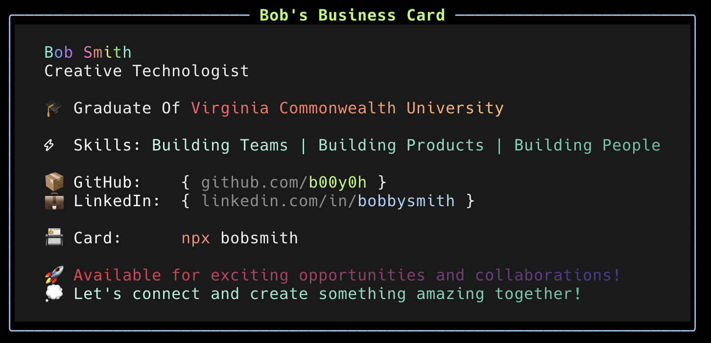

<!--
**b00y0h/b00y0h** is a ✨ _special_ ✨ repository because its `README.md` appears on your GitHub profile.
-->

<!--
<p align="center"></p>
-->
<h1 align="center">Hi 👋, I'm Bob</h1>
<h3 align="center">A passionate Fullstack Developer and Tech Enthusiast</h3>

## 📇 My NPX Business Card

Try out my interactive business card by running:

```bash
npx bobsmith
```



- 🌍 &nbsp; Based in Virginia
- 🔭 &nbsp; Currently working on open source projects and client solutions at [EAB Agency](https://github.com/orgs/eab-agency)
- 💬 &nbsp; Ask me about **React**, **Next.js**, **Node.js**, **TypeScript**, and **CI/CD**
- 📫 &nbsp; Reach me at **<bobby@reversetype.com>**


<p align="center">
  <a href="https://www.linkedin.com/in/bobbysmith/">
    
  </a>
  <a href="https://x.com/ux_bob">
    
  </a>
  <a href="https://github.com/b00y0h">
    
  </a>
</p>

  <!-- GitHub section -->

## My GitHub Stats 

<picture>
  <source media="(prefers-color-scheme: dark)" srcset="profile/stats-dark.svg" />
  
</picture>
<picture>
  <source media="(prefers-color-scheme: dark)" srcset="profile/top-langs-dark.svg" />
  
</picture>
<br clear="both" />

<picture>
  <source media="(prefers-color-scheme: dark)" srcset="https://streak-stats.demolab.com?user=b00y0h&theme=dark&hide_border=true&exclude_days=Sun%2CSat" />
  
</picture>

<!-- GitHub section: END -->

## Getting Things Done

### Todoist Stats

<!-- TODO-IST:START -->
🏆  **2,971** Karma Points           
🌸  Completed **0** tasks today           
✅  Completed **339** tasks so far           
🔥  Current streak: **0 days** - Start one today!           
⏳  Longest streak is **2** days
<!-- TODO-IST:END -->

<!--START_SECTION:waka-->


**🐱 My GitHub Data** 

> 📦 1.4 MB Used in GitHub's Storage 
 > 
> 🏆 623 Contributions in the Year 2026
 > 
> 💼 Opted to Hire
 > 
> 📜 96 Public Repositories 
 > 
> 🔑 24 Private Repositories 
 > 
📊 **This Week I Spent My Time On** 

```text
🕑︎ Time Zone: America/New_York

⏱️ Total Time: 13 hrs 47 mins (Coding: 6 hrs 46 mins, AI Coding: 6 hrs 22 mins, Writing Docs: 37 mins)

💬 Programming Languages: 
sh                       6 hrs 16 mins       ███████████░░░░░░░░░░░░░░   45.54 % 
Other                    4 hrs 16 mins       ████████░░░░░░░░░░░░░░░░░   31.01 % 
Markdown                 1 hr 50 mins        ███░░░░░░░░░░░░░░░░░░░░░░   13.35 % 
Bash                     36 mins             █░░░░░░░░░░░░░░░░░░░░░░░░   04.38 % 
YAML                     33 mins             █░░░░░░░░░░░░░░░░░░░░░░░░   04.05 % 

🔥 Editors: 
Claude Code              6 hrs 28 mins       ████████████░░░░░░░░░░░░░   47.02 % 
Zsh                      6 hrs 16 mins       ███████████░░░░░░░░░░░░░░   45.54 % 
VS Code                  58 mins             ██░░░░░░░░░░░░░░░░░░░░░░░   07.03 % 
Unknown Editor           2 mins              ░░░░░░░░░░░░░░░░░░░░░░░░░   00.29 % 
Terminal                 0 secs              ░░░░░░░░░░░░░░░░░░░░░░░░░   00.11 % 

💻 Operating System: 
Mac                      13 hrs 47 mins      █████████████████████████   100.00 % 
```

**I Mostly Code in TypeScript** 

```text
TypeScript               47 repos            █████████░░░░░░░░░░░░░░░░   35.34 % 
CSS                      7 repos             █░░░░░░░░░░░░░░░░░░░░░░░░   05.26 % 
Shell                    6 repos             █░░░░░░░░░░░░░░░░░░░░░░░░   04.51 % 
Ruby                     4 repos             █░░░░░░░░░░░░░░░░░░░░░░░░   03.01 % 
Go                       2 repos             ░░░░░░░░░░░░░░░░░░░░░░░░░   01.50 % 
```


 Last Updated on February 26, 2026 00:44:42 UTC
<!--END_SECTION:waka-->

<p align="center">
  
</p>

<p align="center">
  
  
  
  
  
  
  
  
</p>
